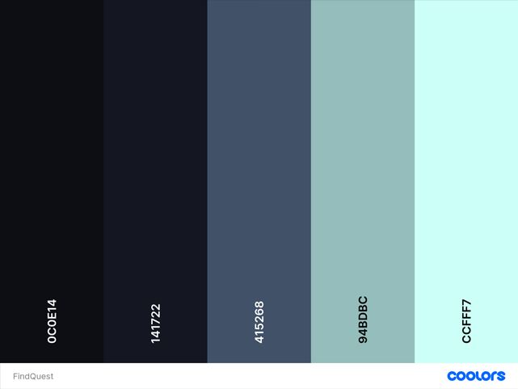
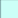

# Layout do Projeto FindQuest

## 1º passo: Definição da Paleta de cores

[^1]: Paleta obtida através do site [Coolors](https://coolors.co)

###  Rich Black FOGRA
- Hexadecimal: #0C0E14
- RGB: 12, 14, 20
- HSL: 255°, 40%, 8%

###  Rich Black FOGRA 2
- Hexadecimal: #0C0E14
- RGB: 20, 23, 34
- HSL: 227, 41%, 13%
- HSL: 255°, 40%, 8%

###  Independence
- Hexadecimal: #415268
- RGB: 65, 82, 104
- HSL: 214, 38%, 41%
- HSL: 255°, 40%, 8%

###  Opal
- Hexadecimal: #94BDBC
- RGB: 148, 189, 188
- HSL: 179, 22%, 74%
- HSL: 255°, 40%, 8%

###  Celeste
- Hexadecimal: #CCFFF7
- RGB: 204, 255, 247
- HSL: 171, 20%, 100%